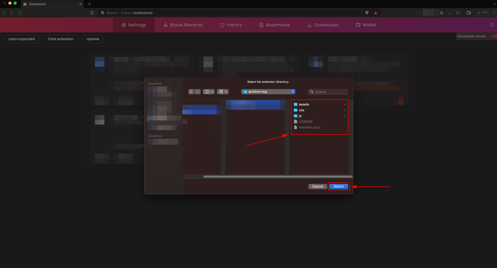
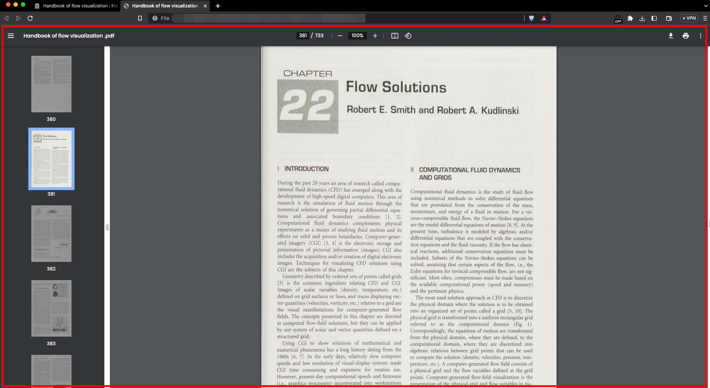

# archive.org Downloader
There are many tons of books on Internet Archive(archive.org) available for public. Some books can only be read online by borrowing for a limited period. This extension can download these books for later reading.

_Note:_ Since this extension is illegal, it has not been added to the Chrome Web Store. You can start using it by configuring manually.

## Install (Manual)

1. Clone the plugin or download it in "zip" format and extract it from "zip".

2. Enter the "Manage Extenions" page.

3. "Load Unpacked" seçeneğine tıklayınız.

4. Enter the file path of the extension you downloaded. Complete the selection.

5. Congratulations! You have successfully installed the extension.

## Extension Usage

1. The image below indicates that you should wait for the book information.

2. The image below acknowledges that the book is not borrowed and will borrow the book for you. If you click the "Cancel" button, it will cancel the checkout.
_Note_: If you borrow the book manually, the extension will be active again.

3. The picture below means you can finally download the book. First select the quality and click the "Download" button.
_Note_: You will see that the successful and unsuccessful numbers change. The images are processed when the download is complete. After downloading, you will see that the number of images processed has also changed.

4. Congratulations! You have managed to download the book in "PDF" format.

## Proof

## Contribute
Do not take a step back for everything you see missing! Please submit a pull request.

## Donate
Find a star in the sky and work hard to reach it.